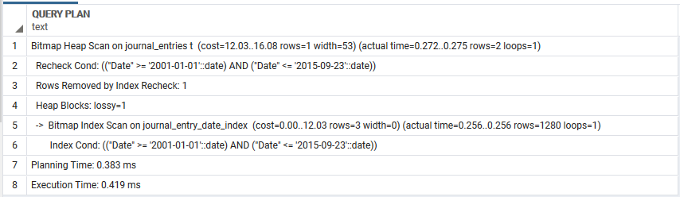
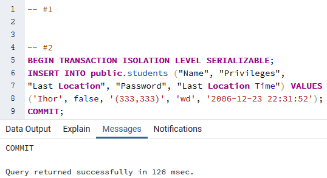

# Лабораторна робота №3
## Умова завдання
Варіант: 24

Види індексів: GIN(students.Name), BRIN(journal_entries.Date).<br>
Умови для тригерів: after update, insert.
## Завдання

## Завдання №2: команди створення індексів, тексти і час виконання запитів SQL

### Команди SQL створення індексів

```sql
CREATE INDEX IF NOT EXISTS students_name_index ON public.students USING gin(name_tsv);

CREATE INDEX journal_entry_date_index ON public.journal_entries USING brin("Date");
``` 

### SQL запити
```sql
Explain analyze SELECT * FROM public.students t WHERE t.name_tsv @@ to_tsquery('english','Petrovuch');
```


```sql
Explain analyze SELECT * FROM public.journal_entries t WHERE t."Date" BETWEEN '2001-01-01' AND '2015-09-23';
```



## Завдання №3: команди, що ініціюють виконання тригера, текст тригера та скріншоти зі змінами у таблицях бази даних

### Код тригеру


### При додаванні/оновленні студентів в базі даних, оновлюється поли, призначене для індексування

  
  
  

## Завдання №4: скріншоти з ходом виконання запитів та їх результатів у обох транзакціях по кожному рівню ізоляції

### READ COMMITTED

<table>
    <tr>
        <td>Transction #1</td>
        <td>Transction #2</td>
    </tr>
    <tr>
        <td>
            <pre lang="sql">
-- #1
BEGIN TRANSACTION ISOLATION LEVEL READ COMMITTED;
SELECT "Name" FROM public.students WHERE 
"Student_ID" = '0002b532-9e6e-4de9-9a87-06db47e9d83a'::uuid;
-- #2
<br>
<br>
-- #3
SELECT "Name" FROM public.students WHERE 
"Student_ID" = '0002b532-9e6e-4de9-9a87-06db47e9d83a'::uuid;
-- #4
<br>
-- #5
SELECT "Name" FROM public.students WHERE 
"Student_ID" = '0002b532-9e6e-4de9-9a87-06db47e9d83a'::uuid;
            </pre>
        </td>
        <td>
            <pre lang="sql">
-- #1
<br>
<br>
-- #2
BEGIN TRANSACTION ISOLATION LEVEL READ COMMITTED;
UPDATE public.students SET "Name" = 'Bogdan' WHERE 
"Student_ID" = '0002b532-9e6e-4de9-9a87-06db47e9d83a'::uuid;
-- #3
<br>
-- #4
COMMIT;
<br>
<br>
            </pre>
        </td>
    </tr>
</table>

| Transaction #1      | Transaction #2      |
|---------------------|---------------------|
|  |                     |
|                     |  |
|  |                     |
|                     |  |
|  |                     |

### REPEATABLE READ

<table>
    <tr>
        <td>Transction #1</td>
        <td>Transction #2</td>
    </tr>
    <tr>
        <td>
            <pre lang="sql">
-- #1
BEGIN TRANSACTION ISOLATION LEVEL REPEATABLE READ;
SELECT "Name" FROM public.students WHERE 
"Student_ID" = '0002b532-9e6e-4de9-9a87-06db47e9d83a'::uuid;
-- #2
<br>
<br>
<br>
-- #3
SELECT "Name" FROM public.students WHERE 
"Student_ID" = '0002b532-9e6e-4de9-9a87-06db47e9d83a'::uuid;
-- #4
COMMIT;
SELECT "Name" FROM public.students WHERE 
"Student_ID" = '0002b532-9e6e-4de9-9a87-06db47e9d83a'::uuid;
            </pre>
        </td>
        <td>
            <pre lang="sql">
-- #1
<br>
<br>
-- #2
BEGIN TRANSACTION ISOLATION LEVEL REPEATABLE READ;
UPDATE public.students SET "Name" = 'Andrii' WHERE 
"Student_ID" = '0002b532-9e6e-4de9-9a87-06db47e9d83a'::uuid;
COMMIT;
-- #3
<br>
-- #4
<br>
<br>
            </pre>
        </td>
    </tr>
</table>

| Transaction #1      | Transaction #2      |
|---------------------|---------------------|
|  |                     |
|                     |  |
|  |                     |
|  |                     |

### SERIALIZABLE

<table>
    <tr>
        <td>Transction #1</td>
        <td>Transction #2</td>
    </tr>
    <tr>
        <td>
            <pre lang="sql">
-- #1
BEGIN TRANSACTION ISOLATION LEVEL SERIALIZABLE;
SELECT COUNT(*) FROM public.students;
-- #2
<br>
<br>
<br>
<br>
-- #3
SELECT COUNT(*) FROM public.students;
-- #4
COMMIT;
SELECT COUNT(*) FROM public.students;
            </pre>
        </td>
        <td>
            <pre lang="sql">
-- #1
<br>
<br>
-- #2
BEGIN TRANSACTION ISOLATION LEVEL SERIALIZABLE;
INSERT INTO public.students ("Name", "Privileges", 
"Last Location", "Password", "Last Location Time") VALUES 
('Ihor', false, '(333,333)', 'wd', '2006-12-23 22:31:52');
COMMIT;
-- #3
<br>
-- #4
<br>
<br>
            </pre>
        </td>
    </tr>
</table>

| Transaction #1      | Transaction #2      |
|---------------------|---------------------|
|   |                     |
|                     |   |
|   |                     |
|   |                     |